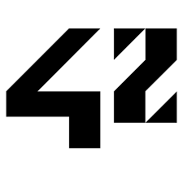

---

I’m Shaly! 
A Computer Science Student at [ 42London](https://42london.com/) and WGU where I am expanding my knowledge in both back-end and front-end development by working on various projects. 💻

My goal is to work on projects that merge creativity, technology, and my love for languages. 
I see programming as a creative process where languages, technology, and innovation come together to solve problems and build meaningful tools. 
It's another way to connect with people across the globe and make a positive impact. 🌎

When I’m not coding, I’m probably learning languages, drawing anime, listening to music, or thinking about pandas (or that stupid bug on line 42). 👾🌸

💌 Reach out to me at: <a href="mailto:shalycatori@gmail.com">shalycatori@gmail.com

---

<!---
color=0:FEAC5B,50:BCB2FF,100:FFAABB&
&color=gradient&customColorList=1&
pandashaly/pandashaly is a ✨ special ✨ repository because its `README.md` (this file) appears on your GitHub profile.
You can click the Preview link to take a look at your changes.
--->

  

    <h2>📊 My GitHub Stats</h2>
     
    <h3>🍩 Donut Debugger | 📚 Lifelong Learner | 💻 Tech Student</h3>
  

   
  

 
 

---

<h3>
   Learning Lab
</h3>

  &nbsp;&nbsp;&nbsp; BUT FIRST THIS &nbsp;&nbsp;&nbsp;

Most of the code you stumble upon here is just me monkeying around... 🐒  
My GitHub primarily reflects my experimentation with new technologies, hobby projects, and learning endeavors. Please view it as a glimpse into my exploration 🧪 rather than a testament to my professional abilities 🦸.

 

  Created with 🫀 and 🧠 by Shaly &nbsp;&nbsp;&nbsp; ©2024  

